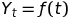
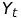
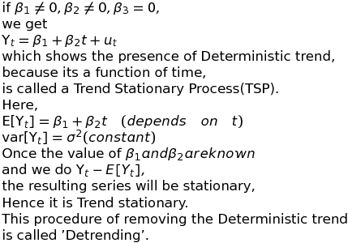

# Time Series

Time series is the sequence of observations on a variable measured over successive periods of time. This measurement may be daily, weekly, monthly, quaterly, annually or any other regular interval of time.
 

e.g. Population of country in different years can be considered as time series where measurement are done on annual basis.

## Components of Time Series

Arrangement of data in occurance of time.

Components of time series:
1.   Trend
2.   Seasonality
3.   Cyclic variation
4.   Irregular or Random Component

### Trend:

Trend is the general tendency of the data to increase, to decrease or  to remain constant over a long period of time. Trend can be linear or non-linear.

### Seasonality:

These variations operates periodically over a span of less than a year. They have the same patter or trend year after year i.e. Seasonal variations are there in the data if data is recorded daily, weekly, quaterly or monthly and if only annual values are given then there are no seasonal variations. e.g. Sale of cotten/woolen clothes in May/Dec.

### Cyclic Variation:

A cyclic pattern exists if the time series plot shows an alternating sequence of point below and above the trend line lasting more than a year.
These are the oscillatory variations in the time series with period of oscillation as more than 1 year with no fixed duration of cycle.
e.g. Business life cycle:

1.   Prosperity
2.   Recession
3.   Depression
4.   Recovery

### Random Variation:

All the other variations in the time series which are not accounted by trend, seasonality, or cyclic variation are known as Irregular or Random Variations.These variationsare totally random and occur due to unavoidable circumstances like natural calamity.

## Time Series Models

Time series has two types of models based on the components:

1. Additive:
   
    

    **Assumption**: Time Series components are independent of one another

2. Multiplicative:

    

    **Assumption**: Time Series components may depend on each other. 

## Data Generating Process(DGP)

The initial curves of time series only provide us with very naive component knowledge of a Time series for a sample period. If we want to speculate the shape of these curves beyond the sample period, we can do this if we know the statistical, or stochastic, or the Data generating process that generates these curves.

The below curve explains the relation and heirarchy of different stochastic processes and helps us understand their transformations and interactions with each other.

### Stochastic Process

A stochastic or random process is a collection of Random variables ordered in time. If we let Y denote a random variable,  

if it is continuous, denoted as Y(t) , 
 

but if it is discrete, we denote it as  ,  .

e.g. *Continuous Stocahstic process* - ECG  
*Discrete Stochastic Process* - GDP, DPI etc.

### Unit Root Stochastic Process
A stochastic Process of the form  

This acts as a test for identifying the nature of stochastic process, whether it is *Stationary* or *Non-stationary*.

#### Stationay Stocahstic Process

A stochastic process is said to be stationary if its mean and variance are constant over time and the value of the covariance between the two time periods depends only on the distance or gap or lag between the two time periods and not the actual time at which covariance is computed.
In short, if a time series is stationary, its mean, variance and autocovariance(at various lags) remains the same no matter at what point we measure them, i.e. they are time invariant. Such a time series will tend to return to its mean(mean reversion) and fluctuations around this mean(variance) will have broadly constant amplitude.

A stationary process will not drift too far away from its mean value because of the infinite variance.

A stationary stochastic process can further be classified into two categories:
    
1. Weak stationary process
2. Strong stationary process 

A time series, $Y_{t}$ is called a stationary time series if it satisfies:

   1. 
   2.    
   3.  - independent of time and depends only on the lag 'k'.

If above three properties are satisfied the process is **'Weak stationary process'**

   4. Probability distribution of   is independent of time.

If in addition to condition first three condition, condition (4.) is also satisfied then we call the process **'Strong stationary process'**.

In real life we don't incur stationary process, we only have non-stationary process which cannot be modelled easily, so we model them as stationary process.

##### Pure Random Process/White Noise Process
A stochastic process or time series, is purely random, or white noise, process if

Also, if it is also independent, such process is called strictly white noise.

i.e. if 

#### Non-Stationary Stochastic Process

A non-stationary time series will have a time-varying mean or a time-varying variance or both.

If a time series is non-stationary, we can study its behaviour only for the time period under consideration. Each set of time series data will therefore be for a particular episode. As a consequnce, it is not possible to generalize it to other time periods.

##### Random Walk Process

Random Walk model(RWM) is a classic example of a non-statonary time series. The asset prices, such as stock prices or exchange rates follows random walk; that is, they are non-stationary in nature.
Random walks can be further distinguished into three types:
1. Random walk without Drift
2. Random walk with Drift
3. Random walk with Drift and Trend.

There can be other inclusions to random walk models but the general idea remains the same.

__**Random Walk without Drift**__

Suppose  is a white noise error term with

the  is said to be a random walk, if

the value  at time t is equal to its value at time (t-1) plus a random shock, .

In the random walk model, the above equation also represent an AR(1) model.

This can be interpreted as a regression of Y at time t on its value lagged one period.

As evident, the variance is a function of *t*, which makes it time variant. 

__**Random Walk with Drift**__

If we modify the equation
 as follows:

It shows that  drifts upwards or downward, depending on δ being positive or negative. This is also an AR(1) model.

Also,

here, both mean and variance are a function of *t* which makes this arrangement non-stationary.

__**Random Walk with Drift and Trend**__

Consider the general stochastic process of the form:

where  is a white noise process.

This can be futher classified into :
1. Deterministic Trend - If the trend in a time series is a deterministic function of time, such as time, time-squared etc.
2. Stochastic Trend - If it is not predictable, we call it a stochastic trend.

Now Consider,

and

Also

### Integrated Stochastic Processes

If a non-stationary time series is differentiated *d* times to convert it into a stationary time series, then we call it as an Integrated process of order d.

e.g. Random walk model without drift is non-stationary, whereas its first difference is stationary. And this is called Integrated Random walk model without drift of order 1, *I(1)*.

### Cointegration

If two non stationary time series are independently Integrated stochastic process of order 1, i.e. *I(1)* and shows similar stochastic trend but there difference shows the presence of *I(0)* i.e. Stationary. This basically means that two time series have a long term, or equilibrium, relationship between them. The time series related like this are called Cointegrated.

